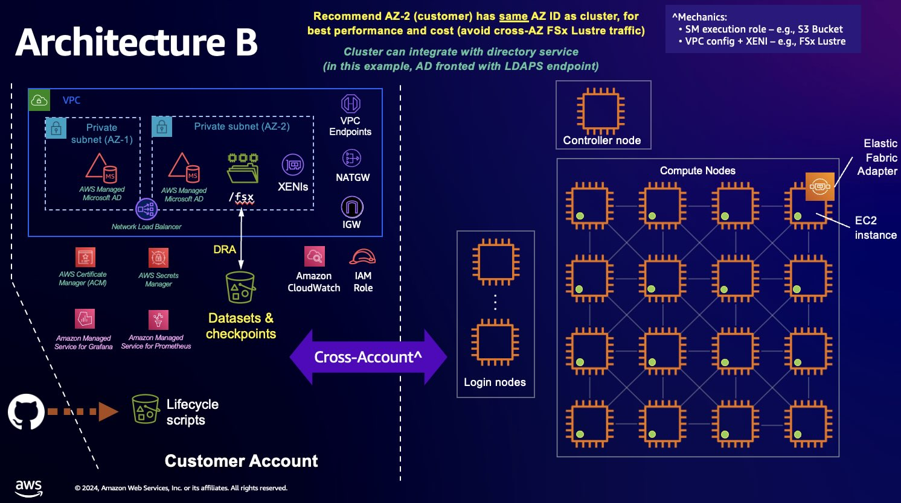

# Advance and experimental quickstart for Amazon SageMaker HyperPod

This repo provides a git-centric workflow to deploy Amazon SageMaker HyperPod clusters, with
quality-of-life improvements and advance architecture.



Unsure if this repo is right for you? Not to worry, we invite you to check if the [vibe of this
repo](doc/ABOUT.md) resonates with you, before making an informed decision.

<details>
<summary><b>Differences against <a href="https://github.com/aws-samples/awsome-distributed-training/tree/b72144be6f6ebf3ee4cd271bc5b2964931e4e094">adt#b72144b</a></b></summary>

- deprecate timesync LCC. Script is still available for older clusters that need it applied in
  ad-hoc fashion (and it ensures chrony does not start with a network namespace).
- hardened `setup_mariadb_accounting.sh`.
- allow ssh to compute nodes without host keys.
- enable [enroot containers](https://github.com/NVIDIA/enroot), but disable the CLIs for non-root
  users on login and controller nodes which may have insufficient root volume for container
  operations. Non-root users must perform container operations (e.g., build images) on compute nodes
  with NVMe.
- enable multi-users via LDAPS. Note that're two independent parts:
  - an [example](#36-create-a-new-aws-managed-microsoft-ad-with-ldaps-endpoint) to setup an LDAPS
    endpoint. Ignore this when you have an existing LDAPS.
  - an [LCC script](src/LifecycleScripts/base-config/setup_sssd4ldaps.sh) to get a cluster connect
    to an LDAPS endpoint.
- disable and mask [GDM (GNOME Display
  Manager)](https://en.wikipedia.org/wiki/GNOME_Display_Manager).
- utility scripts for SMHP client ([bin/](bin/)). Non-exhaustive highlights:
  - `dashboard-cluster-creation.sh` and `dashboard-cluster-update.sh` to show side-by-side the
    cluster creation or update status, and the controller logs. Require
    [tmux](https://github.com/tmux/tmux/wiki) and
    [awslogs](https://github.com/jorgebastida/awslogs).
  - `cluster-status.sh` can export the JSON payload returned by `aws sagemaker describe-cluster ...`
    into the JSON format for `cluster-config.json`. Useful to regenerate a `cluster-config.json` for
    another deployment.
  - `cluster-log.sh` supports watch mode and one-time mode. The watch mode implements retry logic to
    wait for LCC logs to appear in your Cloudwatch log streams. Require
    [awslogs](https://github.com/jorgebastida/awslogs).
  - `show-az.sh` to quickly maps AZ name to AZ id. Typically used when planning cluster deployment.
- utility scripts for the cluster ([src/sample-slurm-jobs/](/src/sample-slurm-jobs/)): trigger
   unhealthy instance and auto-resume Slurm step, probe ami, etc.
- other opinionated changes to shell and environment. Feel free to customize the
   [initsmhp](src/LifecycleScripts/base-config/initsmhp.sh) scripts.

</details>

## 1. Deploy cluster

Deployment overview:

```bash
## Dependencies:
## - mandatory: awscli, boto3, jq
## - optional : awslogs, tmux

# Step 1.1. Create S3 bucket in whatever way you like
# Step 1.2. Create a self-signed certificate and LDAP auth token

# Step 1.3. Update environment variables and add bin/ to PATH.
vi profile.sh src/lcc-data/profile.sh
source profile.sh

# Step 1.4. Create VPC with at least two AZs
cfn.sh

# Step 1.5. Create FSx Lustre in whatever way you like
# Step 1.6. Create AWS Managed MS AD with LDAPS endpoint

# Step 1.7. Create SMHP cluster
vi config-cluster.json src/lcc-data/provisioning_parameters.json
python3 bin/validate-config.py
## Optional: customize files under src/LifecycleScripts/base-config/ and/or src/lcc-data/
# vi ...
cluster-create.sh <CLUSTER_NAME> [--profile xxxxx]
dashboard-cluster-creation.sh <CLUSTER_NAME> [--profile xxxxx]    # Optional
```

Let us now proceed to the detail steps. Before proceeding, in case you don't wish to deploy an AD,
please click below for the added instructions.

<details>
<summary><b>How to skip AD deployment</b></summary>

To not setup AD (and the LDAPS integration with the cluster):

1. ignore [Section 1.2](#12-create-a-self-signed-certificate-and-an-ldap-authentication-token) and
   [Section 1.6](#16-create-a-new-aws-managed-microsoft-ad-with-ldaps-endpoint).
2. in [Section 1.3](#13-edit-profilesh-files-then-on-your-shell-do-a-source-profilesh), make sure
   that `src/lcc-data/profile.sh` sets `SMHP_LDAP_TOKEN_ARN` and `SMHP_LDAP_CERT_ARN` to blank
   values.

</details>

### 1.1. Create an S3 bucket

Make sure to block the public access.

### 1.2. Create a self-signed certificate and an LDAP authentication token

<span style="color:firebrick;background-color:yellow"><b>🚨🚨🚨 Skip this step when you're going to
connect to your existing LDAPS 🚨🚨🚨</b></span>

Now, let's follow **some** of the steps in [AWS ParallelCluster
tutorial](https://docs.aws.amazon.com/parallelcluster/latest/ug/tutorials_05_multi-user-ad.html).
You can do these steps **on your computer** as long as it has the right AWS credentials to execute
the `aws` CLIs.

1. Go to `Step 1: Create the AD infrastructure` / `Manual`.

2. Under `Add users to the AD`:

   Ignore step 1-3, and straight away jump to `4. Add the password to a Secrets Manager secret.`

   Essentially, we are deciding ahead of the AD existence what the LDAP's read-only credential will
   be, and store that as an [AWS Secrets Manager](https://aws.amazon.com/secrets-manager/)
   [secret](https://docs.aws.amazon.com/secretsmanager/latest/userguide/getting-started.html#term_secret).
   **You're strongly recommended to change the example password to something else.**

3. Under `LDAPS with certificate verification (recommended) setup`:

    - `1. Generate domain certificate, locally` on your computer. **REMINDER:** change the domain
         name as needed.

    - `2. Store the certificate to Secrets Manager to make it retrievable from within the cluster
         later on.`

    - `4. Import the certificate to AWS Certificate Manager (ACM).`

### 1.3. Edit `profile.sh` files, then on your shell do a `source ./profile.sh`

Review and edit `profile.sh`:

- use the bucket name created in [Section 3.1](#31-create-an-s3-bucket)
- make sure that `SMHP_AZ_NAME` must include the AZ where your cluster will live.

Review and edit `src/lcc-data/profile.sh`:

- ARN of the LDAP read-only secret created in [Section
  1.2](#12-create-a-self-signed-certificate-and-an-ldap-authentication-token)
- ARN to the certificate created in [Section
  1.2](#12-create-a-self-signed-certificate-and-an-ldap-authentication-token)
- <span style="color:firebrick;background-color:yellow"><b>🚨🚨🚨 If you want to skip setting-up
  LDAPS integration, just set both to <i>blank</i> values 🚨🚨🚨</b></span>

After that, `source ./profile.sh` to set the environment variables for your current shell. The
reminder of this quickstart will need these env vars. **REMINDER:** always do this step when
starting a new shell.

### 1.4. Create a new VPC with at least _two_ AZs

The VPC will have two AZs as AWS Managed Microsoft AD requires two private subnets.

```bash
# Deploy a CloudFormation template.
cfn.sh
```

In case you need to update the stack already deployed, please edit the necessary files (e.g.,
`profile.sh`, `bin/cfn.sh`, or possibly even the `src/01-smhp-vpc.yaml`), then update the stack as
follows:

```bash
# Update an existing CloudFormation stack.
cfn.sh update
```

### 1.5. Create an FSx Lustre

You may create an FSx Lustre filesystem using the AWS console. Make sure to select the security
group from the VPC stack.

### 1.6. Create a new AWS Managed Microsoft AD with LDAPS endpoint

<span style="color:firebrick;background-color:yellow"><b>🚨🚨🚨 Skip this step when you're going to
connect to your existing LDAPS 🚨🚨🚨</b></span>

 Follow the [AWS ParallelCluster
 tutorial](https://docs.aws.amazon.com/parallelcluster/latest/ug/tutorials_05_multi-user-ad.html),
 but only for these specific steps.

 1. Create the AD either by using the Python scripts in `Step 1: Create the AD infrastructure` /
    `Manual`, or using the AWS console. It's important to choose **two private subnets** from the
    VPC stack you've just created in the previous step.

    **REMINDER:** change the directory and domain name as needed, and optionally other information
    as you like.

 2. Follow `Create an EC2 instance`, `Join your instance to the AD`, and `Add users to the AD`.
    **REMINDER**: make sure the `ReadOnlyUser` uses the same password as your AWS Secrets Manager
    secret.

 3. Under `LDAPS with certificate verification (recommended) setup`, do all steps except what you've
 done in [Section 1.2, no. 3](#12-create-a-self-signed-certificate-and-an-ldap-authentication-token)
 (i.e., skip `1`, `2`, and `4`).

The expected outcomes of this section are:

- an AD
- an EC2 instance to configure the AD (i.e., add new users)
- `ReadOnlyUser` which SMHP will use to connect to this AD via LDAPS, and a test user `user000`
  which you may skip.
- an LDAPS endpoint for the AD, in the form of an [Network Load
  Balancer](https://docs.aws.amazon.com/elasticloadbalancing/latest/network/introduction.html) with
  the certificate which you previously imported to the ACM.
- an [Amazon Route53](https://aws.amazon.com/route53/) [hosted
  zone](https://docs.aws.amazon.com/Route53/latest/DeveloperGuide/hosted-zones-working-with.html)
  (i.e., DNS records) to let the SMHP cluster resolve the LDAPS endpoint.

### 1.7. Create SMHP cluster

1. Review and edit `cluster-config.json`. As a rule of thumb, anything with `xxx` needs to be
   updated.
2. Review and edit `src/lcc-data/*` files. As a rule of thumb, anything with `xxx` needs to be
   updated.
3. Optionally, review and edit `src/LifecycleScripts/*`. You should leave them as default unless you
   want to make your own customizations.
4. Optionally, run `python3 bin/validate-config.py` to ensures the above configurations are sound.
   Note that the `.py` scripts require `boto3`.
5. Now it's time to create a cluster:

   ```bash
   cluster-create.sh <CLUSTER_NAME> [--profile xxxx]

   # Optional: side-by-side displays of cluster status and controller logs. Need awslogs and tmux.
   dashboard-cluster-creation.sh <CLUSTER_NAME> [--profile xxxxx]
   ```

## 2. Access HyperPod cluster

For simplicity, connect to the controller node (or login nodes, should you deploy them).

```bash
easy-ssh.sh <CLUSTER_NAME>
```

This should bring you to the controller node:

```bash
# Connect via ssm, so need to switch user.
$ sudo su -l ubuntu

$ sinfo
...
```

You can also test out the sample AD user you created in [Section
1.6](#16-create-a-new-aws-managed-microsoft-ad-with-ldaps-endpoint):

```bash
# Connect via ssm, so need to switch user. This time to the sample AD user.
sudo su -l user000

$ whoami
user000

echo $HOME
/fsx/home/user000
```

## 3. Security

See [CONTRIBUTING](CONTRIBUTING.md#security-issue-notifications) for more information.

## 4. License

This library is licensed under the MIT-0 License. See the LICENSE file.

## 5. References

1. [AWS Workshop: Amazon SageMaker
   HyperPod](https://catalog.workshops.aws/sagemaker-hyperpod/en-US).
2. [AWS Documentation: Amazon SageMaker
   HyperPod](https://docs.aws.amazon.com/sagemaker/latest/dg/sagemaker-hyperpod.html.)
3. [aws-samples/awsome-distributed-training](https://github.com/aws-samples/awsome-distributed-training)
4. [AWS ParallelCluster tutorial: Integrating Active
   Directory](<https://docs.aws.amazon.com/parallelcluster/latest/ug/tutorials_05_multi-user-ad.html>).
