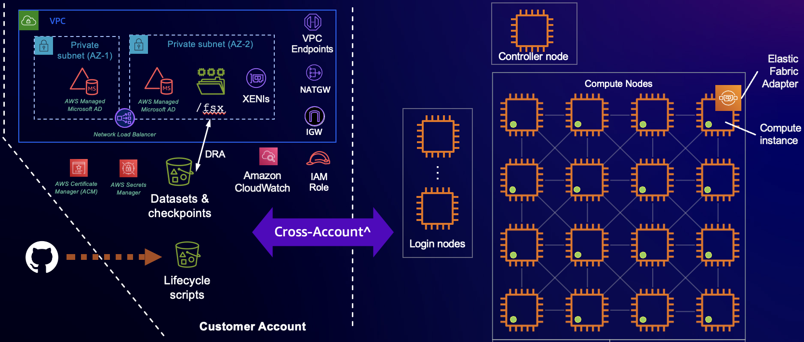

# Advance and experimental quickstart for Amazon SageMaker HyperPod

Before proceeding, please read the [prerequisites](doc/PREREQUISITES.md).

## 1. Changes to the reference LCC scripts

Changelogs against [adt#
d5b0bd9](https://github.com/aws-samples/awsome-distributed-training/tree/d5b0bd9e2fb34b23046d539427d4fb1ef0eecabe):

- require an FSx Lustre, and mount it on `/fsx`
- hardened `setup_mariadb_accounting.sh`.
- enable [time synchronization](https://docs.aws.amazon.com/AWSEC2/latest/UserGuide/set-time.html)
   to prevent torchrun crashes
   ([details](https://github.com/pytorch/pytorch/issues/76287#issuecomment-1958685480)).
- mask unnecessary Slurm daemons
  - mask `slurmd` on controller node
  - mask `slurmctld` on compute nodes and login nodes.
- allow ssh to compute nodes without host keys.
- enable [enroot containers](https://github.com/NVIDIA/enroot). At this moment, please perform
   container operations (including building images) on compute nodes with NVMe. Avoid using the
   controller or login nodes for such purposes, as their low root volume size could easily cause
   them to freeze, rendering them (and potentially the whole cluster) unusable.
- enable multi-users via LDAPS. Note that're two independent parts:
  - an [example](#36-create-a-new-aws-managed-microsoft-ad-with-ldaps-endpoint) to setup an LDAPS
      endpoint. Ignore this when you have an existing LDAPS.
  - an [LCC script](src/LifecycleScripts/base-config/setup_sssd4ldaps.sh) to get a cluster connect
      to an LDAPS endpoint.
- utility scripts for SMHP client ([bin/](bin/))
- utility scripts for the cluster ([src/sample-slurm-jobs/](/src/sample-slurm-jobs/)): trigger
   unhealthy instance and auto-resume Slurm step, probe ami, etc.
- other opinionated changes to shell and environment. Feel free to customize the
   [initsmhp](src/LifecycleScripts/base-config/initsmhp.sh) scripts.

## 2. Architecture



## 3. Deploy cluster

This section shows the end-to-end deployment for all the capabilities in [Section
2](#2-architecture). Below are the skeleton of the steps:

```bash
## Pre-requisite: awscli, jq, boto3

# Step 3.1. Create S3 bucket in whatever way you like
# Step 3.2. Create a self-signed certificate and LDAP auth token

# Step 3.3. Update environment variables
vi profile.sh src/lcc-data/profile.sh
source profile.sh

# Step 3.4. Create VPC with at least two AZs
bin/cfn.sh

# Step 3.5. Create FSx Lustre in whatever way you like
# Step 3.6. Create AWS Managed MS AD with LDAPS endpoint

# Step 3.7. Create SMHP cluster
vi config-cluster.json src/lcc-data/provisioning_parameters.json
python3 bin/validate-config.py
## Optional: customize files under src/LifecycleScripts/ and/or src/lcc-data/
# vi ...
bin/cluster-create.sh <CLUSTER_NAME> [--profile xxxxx]
bin/watch-cluster.sh <CLUSTER_NAME> [--profile xxxxx]    # Optional
```

Let us now proceed to the detail steps. Before proceeding, in case you don't wish to deploy an AD,
please click below for the added instructions.

<details>
<summary><b>How to skip AD deployment</b></summary>

To not setup AD (and the LDAPS integration with the cluster):

1. ignore [Section 3.2](#32-create-a-self-signed-certificate-and-an-ldap-authentication-token) and
   [Section 3.6](#36-create-a-new-aws-managed-microsoft-ad-with-ldaps-endpoint).
2. in [Section 3.3](#33-edit-profilesh-files-then-on-your-shell-do-a-source-profilesh), make sure that
   `src/lcc-data/profile.sh` sets `SMHP_LDAP_TOKEN_ARN` and `SMHP_LDAP_CERT_ARN` to blank values.

</details>

### 3.1. Create an S3 bucket

Make sure to block the public access.

### 3.2. Create a self-signed certificate and an LDAP authentication token

<span style="color:firebrick;background-color:yellow"><b>🚨🚨🚨 Skip this step when you're going to
connect to your existing LDAPS 🚨🚨🚨</b></span>

Now, let's follow **some** of the steps in [AWS ParallelCluster
tutorial](https://docs.aws.amazon.com/parallelcluster/latest/ug/tutorials_05_multi-user-ad.html).
You can do these steps **on your computer** as long as it has the right AWS credentials to execute
the `aws` CLIs.

1. Go to `Step 1: Create the AD infrastructure` / `Manual`.

2. Under `Add users to the AD`:

   Ignore step 1-3, and straight away jump to `4. Add the password to a Secrets Manager secret.`

   Essentially, we are deciding ahead of the AD existence what the LDAP's read-only credential will
   be, and store that as an [AWS Secrets Manager](https://aws.amazon.com/secrets-manager/)
   [secret](https://docs.aws.amazon.com/secretsmanager/latest/userguide/getting-started.html#term_secret).
   **You're strongly recommended to change the example password to something else.**

3. Under `LDAPS with certificate verification (recommended) setup`:

    - `1. Generate domain certificate, locally` on your computer. **REMINDER:** change the domain
         name as needed.

    - `2. Store the certificate to Secrets Manager to make it retrievable from within the cluster
         later on.`

    - `4. Import the certificate to AWS Certificate Manager (ACM).`

### 3.3. Edit `profile.sh` files, then on your shell do a `source ./profile.sh`

Review and edit `profile.sh`:

- use the bucket name created in [Section 3.1](#31-create-an-s3-bucket)
- make sure that `SMHP_AZ_NAME` must include the AZ where your cluster will live.

Review and edit `src/lcc-data/profile.sh`:

- ARN of the LDAP read-only secret created in [Section
  3.2](#32-create-a-self-signed-certificate-and-an-ldap-authentication-token)
- ARN to the certificate created in [Section
  3.2](#32-create-a-self-signed-certificate-and-an-ldap-authentication-token)
-
  <span style="color:firebrick;background-color:yellow"><b>🚨🚨🚨 If you want to skip setting-up
  LDAPS integration, just set both to <i>blank</i> values 🚨🚨🚨</b></span>

After that, `source ./profile.sh` to set the environment variables for your current shell. The
reminder of this quickstart will need these env vars. **REMINDER:** always do this step when
starting a new shell.

### 3.4. Create a new VPC with at least _two_ AZs

The VPC will have two AZs as AWS Managed Microsoft AD requires two private subnets.

```bash
# Deploy a CloudFormation template.
bin/cfn.sh
```

In case you need to update the stack already deployed, please edit the necessary files (e.g.,
`profile.sh`, `bin/cfn.sh`, or possibly even the `src/01-smhp-vpc.yaml`), then update the stack as
follows:

```bash
# Update an existing CloudFormation stack.
bin/cfn.sh update
```

### 3.5. Create an FSx Lustre

You may create an FSx Lustre filesystem using the AWS console. Make sure to select the security
group from the VPC stack.

### 3.6. Create a new AWS Managed Microsoft AD with LDAPS endpoint

<span style="color:firebrick;background-color:yellow"><b>🚨🚨🚨 Skip this step when you're going to
connect to your existing LDAPS 🚨🚨🚨</b></span>

 Follow the [AWS ParallelCluster
 tutorial](https://docs.aws.amazon.com/parallelcluster/latest/ug/tutorials_05_multi-user-ad.html),
 but only for these specific steps.

 1. Create the AD either by using the Python scripts in `Step 1: Create the AD infrastructure` /
    `Manual`, or using the AWS console. It's important to choose **two private subnets** from the
    VPC stack you've just created in the previous step.

    **REMINDER:** change the directory and domain name as needed, and optionally other information
    as you like.

 1. Follow `Create an EC2 instance`, `Join your instance to the AD`, and `Add users to the AD`.
    **REMINDER**: make sure the `ReadOnlyUser` uses the same password as your AWS Secrets Manager
    secret.

 1. Under `LDAPS with certificate verification (recommended) setup`, do all steps except what you've
 done in [Section 3.2, no. 3](#32-create-a-self-signed-certificate-and-an-ldap-authentication-token)
 (i.e., skip `1`, `2`, and `4`).

The expected outcomes of this section are:

- an AD
- an EC2 instance to configure the AD (i.e., add new users)
- `ReadOnlyUser` which SMHP will use to connect to this AD via LDAPS, and a test user `user000`
  which you may skip.
- an LDAPS endpoint for the AD, in the form of an [Network Load
  Balancer](https://docs.aws.amazon.com/elasticloadbalancing/latest/network/introduction.html) with
  the certificate which you previously imported to the ACM.
- an [Amazon Route53](https://aws.amazon.com/route53/) [hosted
  zone](https://docs.aws.amazon.com/Route53/latest/DeveloperGuide/hosted-zones-working-with.html)
  (i.e., DNS records) to let the SMHP cluster resolve the LDAPS endpoint.

### 3.7. Create SMHP cluster

1. Review and edit `cluster-config.json`. As a rule of thumb, anything with `xxx` needs to be
   updated.
2. Review and edit `src/lcc-data/*` files. As a rule of thumb, anything with `xxx` needs to be
   updated.
3. Optionally, review and edit `src/LifecycleScripts/*`. You can leave them as default, since
   they've been tailored to enable the cluster with the capabilities mentioned in [Section
   2](#2-architecture). However, feel free to make your own modifications, e.g., to disable what you
   don't need in `src/LifecycleScripts/base-config/lifecycle_script.py`, etc.
4. Optionally, run `python3 bin/validate-config.py` to ensures the above configurations are sound.
   Note that the `.py` scripts require `boto3`.
5. Now it's time to create a cluster:

   ```bash
   bin/cluster-create.sh <CLUSTER_NAME> [--profile xxxx]

   # Monitor cluster creation on AWS Console: SageMaker / HyperPod Clusters / Cluster Management
   # Alternatively, use below convenience util script. When watching, press ^C to stop.
   bin/watch-cluster.sh <CLUSTER_NAME> [--profile xxxxx]

   # Watch cluster log. NOTE: remove `--watch` to do one-time fetch of the log
   bin/cluster-log.sh <CLUSTER_NAME> --watch
   ```

## 4. Access HyperPod cluster

For simplicity, connect to the controller node (or login nodes, should you deploy them)

```bash
bin/easy-ssh.sh <CLUSTER_NAME>
```

This should bring you to the controller node:

```bash
# Connect via ssm, so need to switch user.
$ sudo su -l ubuntu

$ sinfo
...
```

You can also test out the sample AD user you created in xxx:

```bash
# Connect via ssm, so need to switch user. This time to the sample AD user.
sudo su -l user000

$ whoami
user000

echo $HOME
/fsx/home/user000
```

## 5. Security

See [CONTRIBUTING](CONTRIBUTING.md#security-issue-notifications) for more information.

## 6. License

This library is licensed under the MIT-0 License. See the LICENSE file.

## 7. References

1. [AWS Workshop: Amazon SageMaker
   HyperPod](https://catalog.workshops.aws/sagemaker-hyperpod/en-US).
2. [aws-samples/awsome-distributed-training](https://github.com/aws-samples/awsome-distributed-training)
3. [AWS ParallelCluster tutorial: Integrating Active
   Directory](<https://docs.aws.amazon.com/parallelcluster/latest/ug/tutorials_05_multi-user-ad.html>).
