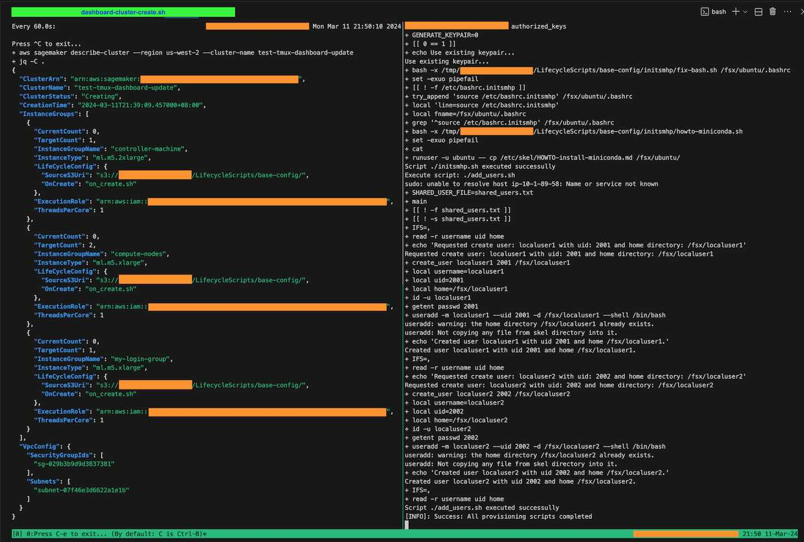
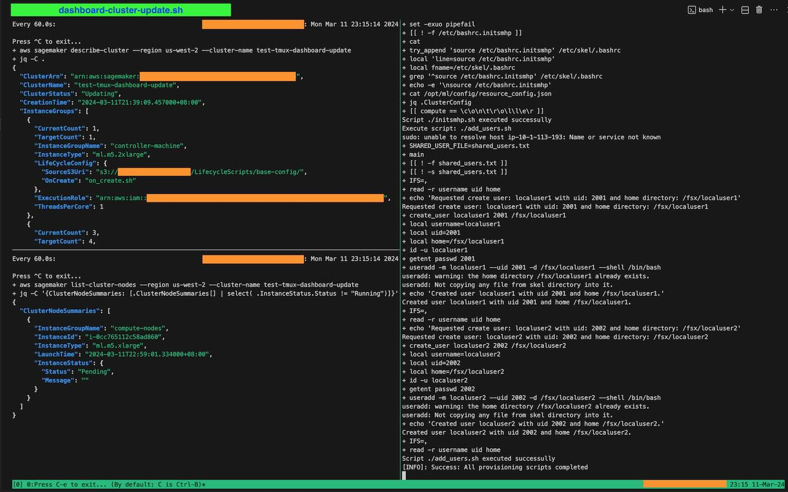
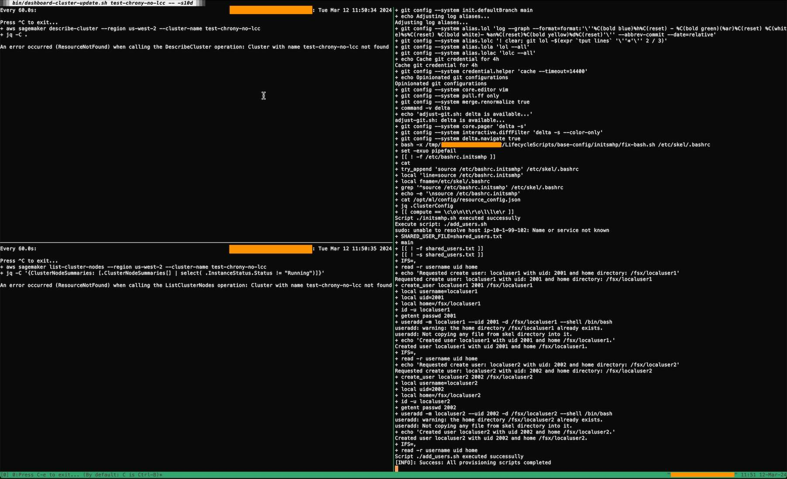

# CLI utilities

Pre-requisites: [tmux](https://github.com/tmux/tmux/wiki),
[awslogs](https://github.com/jorgebastida/awslogs), and [awscli](https://aws.amazon.com/cli/). OSX
users can use [homebrew](https://brew.sh) to install these deps: `brew install tmux awslogs awscli`.

Please note the minimum version of `awscli` is `>=1.31.3` or `>=2.14.3`.

<details>
<summary><b>Install pre-requisites on Linux: an overview</b></summary>

Linux users should refer the installation instructions from those dependencies. Typically:

- `tmux` is usually available via package managers (e.g., `apt`, `yum`, etc.).
- `awslogs` is a Python package and can be installed with different ways: Linux package manager (if
  your distro provides this dependency), `pip`, or your preferred environment manager (e.g.,
  `conda`, `virtualenv`, etc.).
- `awscli` [installation steps](https://aws.amazon.com/cli/).

</details>

## 1. Simple CLI Dashboards

We assume `bin/` has been added to `PATH`, otherwise please run the command as `bin/<CMD>`.

### 1.1. Watch cluster creation

To watch cluster creation, use `dashboard-cluster-creation.sh <CLUSTER_NAME>`. This starts a `tmux`
session with two panes (see screenshot below). The left pane shows the cluster status, and the right
pane streams streams the CloudWatch logs of the *first* instance in the controller group
(customizable).



More examples:

```console
# By default, stream the log of the first instance in InstanceGroup `controller-machine`.
$ dashboard-cluster-creation.sh <CLUSTER_NAME>

# To stream from another instance group
$ dashboard-cluster-creation.sh <CLUSTER_NAME> -g <INSTANCE_GROUP_NAME>

# By default, stream the log since the past 10 minutes. To watch a cluster created long time ago
# (e.g., 4 days ago), add `-- -s4d`. Refer to awslogs documentation for the exact syntax of `-s`.
$ dashboard-cluster.creation.sh <CLUSTER_NAME> -- -s4d
$ dashboard-cluster.creation.sh <CLUSTER_NAME> -g <INSTANCE_GROUP_NAME> -- -s4d
```

### 1.2. Watch cluster update

To watch cluster update, use `dashboard-cluster-update.sh <CLUSTER_NAME>`. This starts a `tmux`
session with three panes (see screenshot below). The top-left pane shows the cluster status, the
bottom-left pane lists the *non-running* nodes, and the right pane streams streams the CloudWatch
logs of the *first* non-running instance in the compute group (customizable).



When cluster update completes successfuly, the top-left pane shows cluster status `InService`, and
the bottom-left pane shows an empty list because all nodes are in the `Running` state.

More examples:

```console
# By default, stream the log of the first non-running instance in InstanceGroup `compute-nodes`.
$ dashboard-cluster-update.sh <CLUSTER_NAME>

# To stream from another instance group, add `-g ...`.
$ dashboard-cluster-update.sh <CLUSTER_NAME> -g <INSTANCE_GROUP_NAME>
```

You can also watch a cluster deletion. Note that once the cluster is gone, the left-pane and
right-pane will show an error (which is expected).


